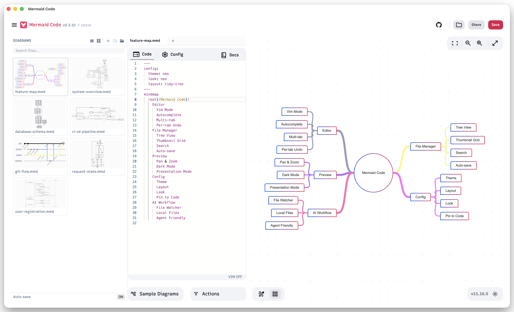
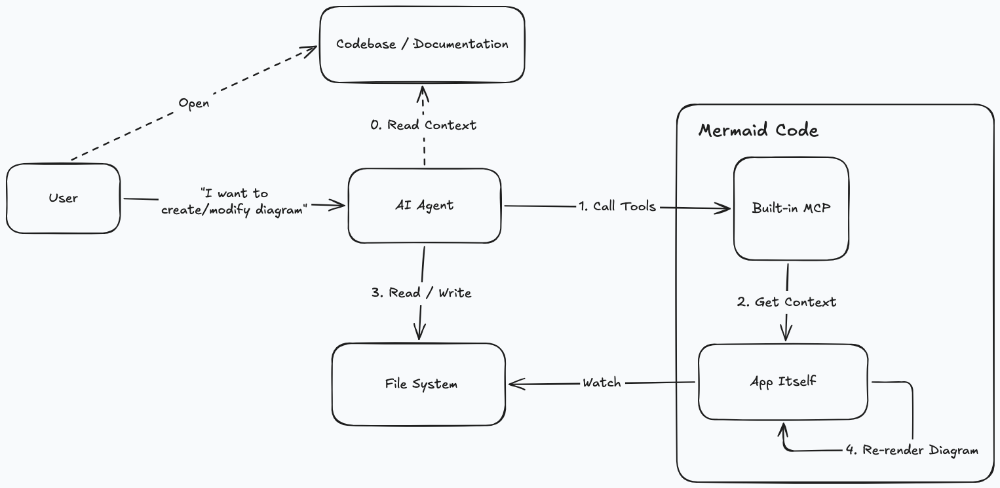

[](https://github.com/m8524769/mermaid-code/releases)

English | [简体中文](README.zh-CN.md)

# Mermaid Code

A local-first Mermaid diagram editor built on [Mermaid Live Editor](https://github.com/mermaid-js/mermaid-live-editor), enhanced with AI agent integration and desktop-native features via [Tauri](https://tauri.app).



## Built for AI-First Workflows

Mermaid Code is designed around AI-native diagram workflows.

**Built-in AI Agent panel** — chat with Claude Code directly inside the app. Ask it to create, modify, or explain diagrams in your project folder. The agent has full access to your local files and the MCP server, so it can read your codebase, write `.mmd` files, and see the live preview — all without leaving Mermaid Code.

External AI agents (Codex, OpenCode, etc.) can also connect via the built-in MCP server to interact with the app, read your codebase, and write diagrams directly — no copy-pasting, no browser automation required.

```
# Example: ask your AI agent to generate a diagram from code
"Generate an architecture diagram for this module and save it to docs/architecture.mmd"
```

The built-in file watcher detects changes instantly and refreshes the preview, closing the loop between AI generation and visual feedback. This workflow is not possible with browser-based editors.



Everything stays local — architecture diagrams, database schemas, and business flows never leave your machine. No terms of service, no data retention policies to worry about.

Download the latest installer for macOS or Windows from the [Releases](https://github.com/m8524769/mermaid-code/releases) page.

### Install via Homebrew (macOS)

```sh
brew tap m8524769/tap
brew install --cask mermaid-code
```

> Since the app is not signed with an Apple Developer certificate, macOS may block it on first launch.
> Go to **System Settings → Privacy & Security** and click **Open Anyway** next to the Mermaid Code entry.
> If that doesn't work (e.g. on macOS 27 Beta), run the following command in Terminal:
>
> ```sh
> xattr -dr com.apple.quarantine "/Applications/Mermaid Code.app"
> ```

## Enhancements over Mermaid Live Editor

### AI Agent Panel

- **Built-in Claude Code integration** — chat with Claude Code directly inside the app without switching windows
- Multi-turn conversations with session history — resume previous sessions per folder
- **Built-in MCP server** — lets AI agents interact with the app directly (see [MCP Server Integration](#mcp-server-integration-experimental))

### Desktop App (Tauri)

- Native macOS/Windows application
- Local file system access — open, edit, and save `.mmd` files directly
- "Open with" support — double-click any `.mmd` or `.mermaid` file in Finder or Explorer to open it directly in Mermaid Code
- App quit guard: prompts when unsaved changes exist on close

### File Manager Sidebar

- Open any local folder and browse its file tree or thumbnail grid view (SVG previews of all diagrams in the folder and subdirectories)
- Drag and drop `.mmd` files or folders directly onto the app window to open them
- Multi-tab editing — open multiple diagrams simultaneously
- Tab and active file restored per folder on next launch
- Auto-save with toggle (default on, 2s debounce)
- Hover actions: new file, new folder, rename, delete

### Editor

- **Vim mode** — toggle with the VIM ON/OFF button in the status bar
- **Keyword autocomplete** — diagram-type-aware suggestions

### Config Tab

- **Visual form** — set theme, layout, and font family without editing JSON directly
- **Pin to code** — inserts the current config as a YAML frontmatter block at the top of the diagram code; re-clicking replaces the existing block

---

## MCP Server Integration <sup>experimental</sup>

Mermaid Code includes a built-in [MCP](https://modelcontextprotocol.io) server that lets AI agents interact with the app directly.

**Enable the MCP server:**
Open Mermaid Code → click the menu icon → toggle **MCP Server** on. The server starts on `http://localhost:37079/mcp`.

**Configure your MCP client** (e.g. Claude Code, Cursor, Windsurf):

```json
{
  "mcpServers": {
    "mermaid-code-mcp": {
      "type": "http",
      "url": "http://localhost:37079/mcp"
    }
  }
}
```

For Claude Code:

```sh
claude mcp add --transport http mermaid-code-mcp http://localhost:37079/mcp
```

**Available tools:**

| Tool              | Description                                                                                                         |
| ----------------- | ------------------------------------------------------------------------------------------------------------------- |
| `list_diagrams`   | Get the opened folder, list of `.mmd` files, and the active tab. Call this first to understand the current context. |
| `preview_diagram` | Preview Mermaid diagram in the Draft tab (replaces existing Draft content).                                         |

**Example — modifying an existing diagram:**

```
"Add an error handling branch to the current diagram"
→ Agent calls list_diagrams to get the active file path
→ Agent reads the file content directly from the filesystem
→ Agent writes the modified diagram back to the file
→ Mermaid Code detects the change and refreshes the preview automatically
```

**Example — previewing without saving:**

```
"Preview a flowchart showing the user registration flow"
→ Agent generates Mermaid code and calls preview_diagram
→ The diagram appears instantly in Mermaid Code's Draft tab
```

---

## Development Requirements

- [Node.js](https://nodejs.org/en/) ≥ 24
- [pnpm](https://pnpm.io/) — install with `corepack enable pnpm`
- [Rust](https://rustup.rs/) — required for Tauri desktop build

### Desktop Development

```sh
source ~/.cargo/env   # load Rust toolchain if needed
pnpm tauri:dev
```

### Desktop Build

```sh
pnpm tauri:build
```

Build with MCP server binary included:

```sh
pnpm tauri:build:full
```

---

## Troubleshooting

### App freezes or crashes

If the app becomes unresponsive or crashes, it may be caused by a diagram or config that causes mermaid to hang during rendering.

**Workaround:** Move the suspected `.mmd` file(s) to a different folder outside the opened directory, then relaunch the app. Once the app is responsive again, move the files back and identify the problematic diagram or config.

---

## Original Project

Fork of [mermaid-live-editor](https://github.com/mermaid-js/mermaid-live-editor).
Web-only version: [mermaid.live](https://mermaid.live)
