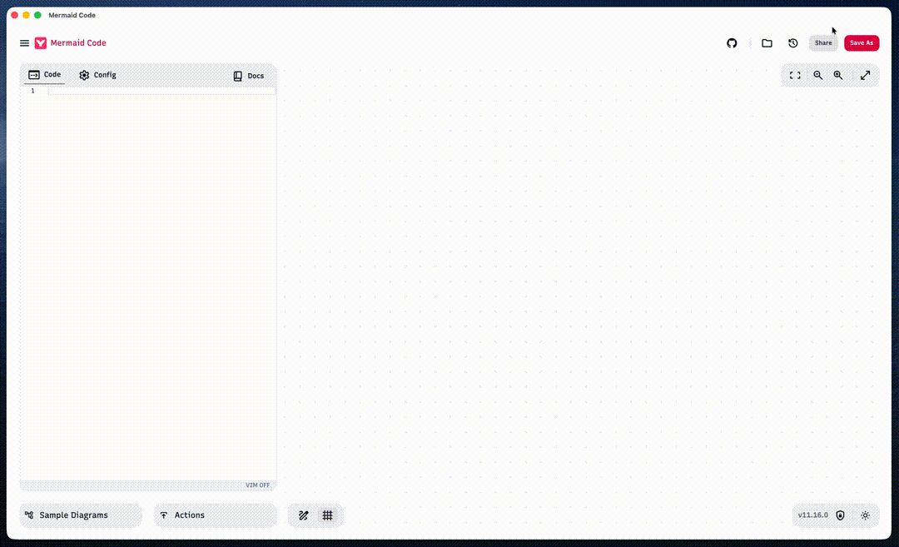

[](https://github.com/m8524769/mermaid-code/releases)

# Mermaid Code

A local-first Mermaid diagram editor built on [Mermaid Live Editor](https://github.com/mermaid-js/mermaid-live-editor), enhanced with desktop-native features via [Tauri](https://tauri.app).



Download the latest installer for macOS or Windows from the [Releases](https://github.com/m8524769/mermaid-code/releases) page.

### Install via Homebrew (macOS)

```sh
brew tap m8524769/tap
brew install --cask mermaid-code
```

> Since the app is not signed with an Apple Developer certificate, macOS may block it on first launch.
> Go to **System Settings → Privacy & Security** and click **Open Anyway** next to the Mermaid Code entry.

## Enhancements over Mermaid Live Editor

### Desktop App (Tauri)

- Native macOS/Windows application
- Local file system access — open, edit, and save `.mmd` files directly
- App quit guard: prompts when unsaved changes exist on close

### File Manager Sidebar

- Open any local folder and browse its file tree or thumbnail grid view (SVG previews of all diagrams in the folder and subdirectories)
- Drag and drop `.mmd` files or folders directly onto the app window to open them
- Multi-tab editing — open multiple diagrams simultaneously
- Tab and active file restored per folder on next launch
- Auto-save with toggle (default on, 2s debounce)
- Hover actions: new file, new folder, rename, delete

### Editor

- **Vim mode** — toggle with the VIM ON/OFF button in the status bar
- **Keyword autocomplete** — diagram-type-aware suggestions

### Config Tab

- **Visual form** — set theme, layout, and font family without editing JSON directly
- **Pin to code** — inserts the current config as a YAML frontmatter block at the top of the diagram code; re-clicking replaces the existing block

---

## Requirements

- [Node.js](https://nodejs.org/en/) ≥ 24
- [pnpm](https://pnpm.io/) — install with `corepack enable pnpm`
- [Rust](https://rustup.rs/) — required for Tauri desktop build

## Web Development

```sh
pnpm install
pnpm dev -- --open
```

## Desktop Development (Tauri)

```sh
source ~/.cargo/env   # load Rust toolchain if needed
pnpm tauri:dev
```

## Desktop Build

```sh
pnpm tauri:build
```

---

## Troubleshooting

### App freezes or crashes

If the app becomes unresponsive or crashes, it may be caused by a diagram or config that causes mermaid to hang during rendering.

**Workaround:** Move the suspected `.mmd` file(s) to a different folder outside the opened directory, then relaunch the app. Once the app is responsive again, move the files back and identify the problematic diagram or config.

---

## Original Project

Fork of [mermaid-live-editor](https://github.com/mermaid-js/mermaid-live-editor).
Web-only version: [mermaid.live](https://mermaid.live)
